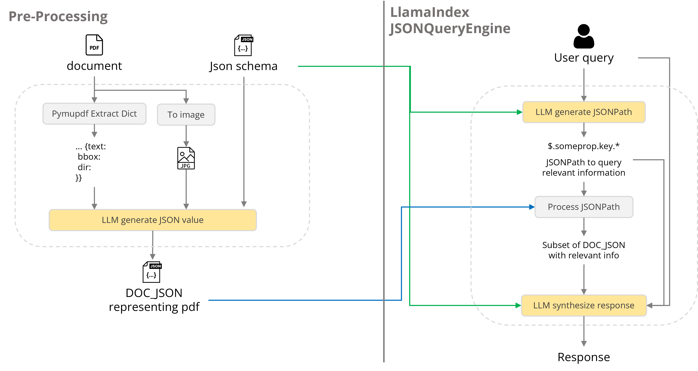

# AI Information Extraction - Ask a Data Sheet

This project uses AI to extract information from PDF files and make it searchable. For factual retrieval of information, the system leverages Retrieval Augmented Augmentation (RAG). In doing so, the retrieved information is represented in a JSON structure that forms the factual context for user queries.

### Prerequisites and Installing
1. Clone the git repo
2. Install at least python 3.12.##
3. Install the required packages: `pip install -r requirements.txt`
4. Set your OpenAI API key in the `.env` file.
5. Run the script: `python demo.py`

## Usage

1. Upload a PDF file.
2. The AI will extract the data from the PDF and generate a JSON file.
3. The AI will also generate a JSON schema file.
4. You can then interact with the document using natural language queries.

## Architecture

## Notes

This project uses the OpenAI GPT-4 model for information extraction and query processing.
Hence, usage of API require token payment (Charges).

## Authors

* **Christoffer Björkskog** - *Initial work* - [melonkernel](https://github.com/melonkernel)
* **Christian Möller** - [chrmolnovia](https://github.com/chrmolnovia)
* **Lamin Jatta** - [Lamboyjat](https://github.com/Lamboyjat)

See also the list of [people](https://github.com/orgs/Novia-RDI-Seafaring/people) who participated in this project.
